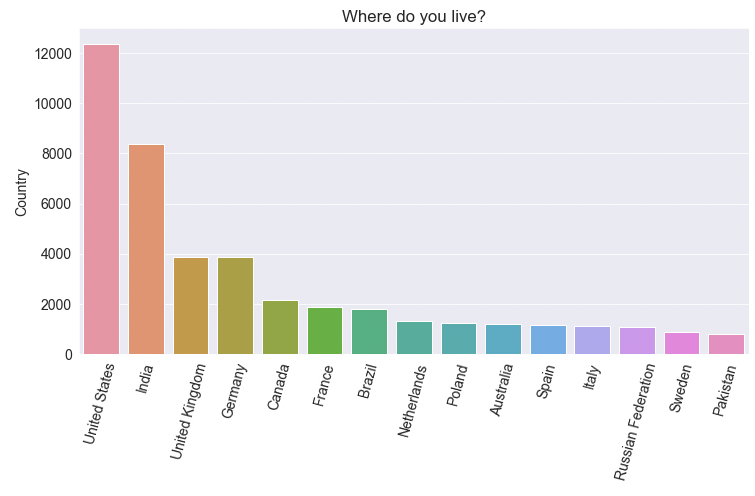

# DataAnalysis
 </br>
A repository that is the basis for learning and increasing skills in the field of Data Science. </br>
As part of this Nootebook, I practiced modules such as numpy, pandas, matplotlib, seaborn. This allowed for the proper preparation of the data and then for presenting them in a way that allows the extraction of the biggest amount of interacting information. </br>
It is based on these [materials](https://jovian.ai/learn/data-analysis-with-python-zero-to-pandas).

## Table of Contents.
- [Using files](#using-files)

- [Numerical Computing with Numpy](#numerical-computing-with-numpy)

- [Analyzing Tabular Data with Pandas](#analyzing-tabular-data-with-pandas)

- [Visualization with Matplotlib and Seaborn](#visualization-with-matplotlib-and-seaborn)

- [Data Analysis](#data-analysis)


## Using files
All files in the repository type are Jupter Nootebook files. </br>
I recommend using [Anaconda](https://www.anaconda.com/) or [Google Colab](https://colab.research.google.com/notebooks/intro.ipynb) to run these files.

## Numerical Computing with Numpy
Topic devoted to exploring the Numpy library for numerical computing in Python. </br>

This covers the following topics:
- Working with numerical data in Python
- Going from Python lists to Numpy arrays
- Multi-dimensional Numpy arrays and their benefits
- Array operations, broadcasting, indexing, and slicing
- Working with CSV data files using Numpy

To fully find out about all the issues mentioned above, please check the file **"section1_numerical_computing_with_numpy.ipynb"** </br>

## Analyzing Tabular Data with Pandas
Topic devoted to exploring the Pandas library for analyzing tabular data in Python. </br>
This covers the following topics:

- Reading a CSV file into a Pandas data frame
- Retrieving data from Pandas data frames
- Querying, soring, and analyzing data
- Merging, grouping, and aggregation of data
- Extracting useful information from dates
- Basic plotting using line and bar charts
- Writing data frames to CSV files

To fully find out about all the issues mentioned above, please check the file **"section2_pandas_data_analysis.ipynb"** </br>

## Visualization with Matplotlib and Seaborn
Topic devoted to exploring the common data visualization techniques using the Matplotlib and Seaborn libraries. </br>
This covers the following topics:

- Creating and customizing line charts using Matplotlib
- Visualizing relationships between two or more variables using scatter plots
- Studying distributions of variables using histograms & bar charts to 
- Visualizing two-dimensional data using heatmaps
- Displaying images using Matplotlib's `plt.imshow`
- Plotting multiple Matplotlib and Seaborn charts in a grid

To fully find out about all the issues mentioned above, please check the file **"section3_matplotlib_data_visualization.ipynb"** </br>

## Data Analysis
This topic covers applying everything from the previous lectures to perform end-to-end exploratory data analysis on a real-world dataset. </br>
Data comes from [EDA on StackOverflow Developer Survey](https://insights.stackoverflow.com/survey/2020). </br>
The following topics are covered:

- Selecting and downloading a dataset
- Data preparation and cleaning
- Exploratory analysis and visualization
- Asking and answering interesting questions
- Summarizing inferences and drawing conclusions

To fully find out about all the issues mentioned above, please check the file **"section4_stackoverflow_survey.ipynb"** </br>

Below are some examples of issues discussed in this topic:

*** We can identify the countries with the highest number of respondents? ***
```
top_countries = survey_df.Country.value_counts().head(15)
top_countries
```
```
United States         12371
India                  8364
United Kingdom         3881
Germany                3864
Canada                 2175
France                 1884
Brazil                 1804
Netherlands            1332
Poland                 1259
Australia              1199
Spain                  1157
Italy                  1115
Russian Federation     1085
Sweden                  879
Pakistan                802
Name: Country, dtype: int64
```
Also we can visualize this information using a bar chart. </br>
  </br>
</br>


*** What is the distribution of respondents' age ? ***
```
plt.figure(figsize=(12, 6))
plt.title(schema.Age)
plt.xlabel('Age')
plt.ylabel('Number of respondents')

plt.hist(survey_df.Age, bins=np.arange(10,80,5), color='purple');
```

  </br>

*** What was your primary field of study? ***
```
undergrad_pct = survey_df.UndergradMajor.value_counts() * 100 / survey_df.UndergradMajor.count()

sns.barplot(x=undergrad_pct, y=undergrad_pct.index)

plt.title(schema.UndergradMajor)
plt.ylabel(None);
plt.xlabel('Percentage');
```
  </br>

The above examples are only part of the analysis performed. The whole thing is correctly formatted and described in the file **"section4_stackoverflow_survey.ipynb"**. </br>
